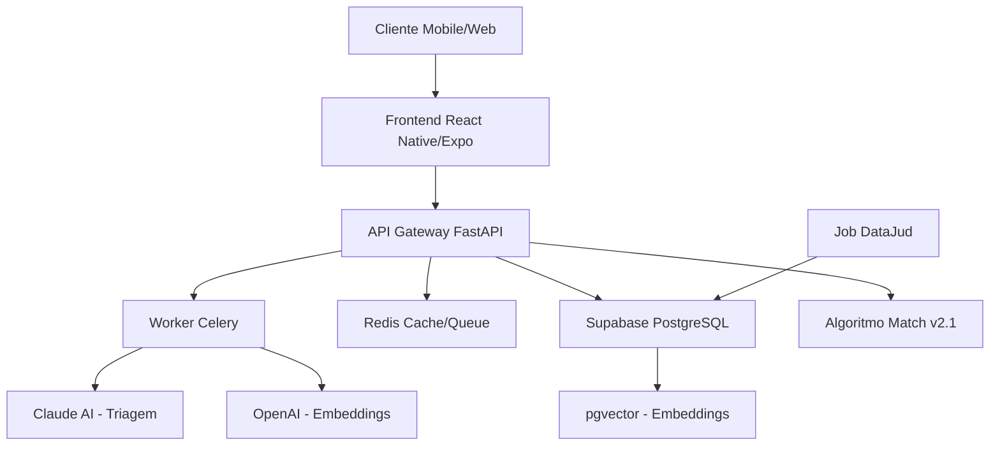
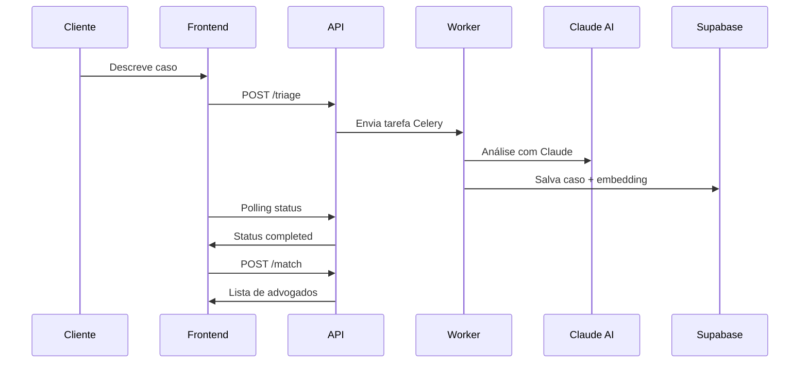

# 📚 Documentação Completa - LITGO5

## 🎯 Visão Geral do Projeto

O **LITGO5** é um sistema de match jurídico inteligente que conecta clientes a advogados especializados através de algoritmos de IA e análise semântica. O sistema utiliza processamento de linguagem natural (LLM) para triagem de casos e um algoritmo proprietário para ranking de advogados.

### 🏗️ Arquitetura do Sistema



---

## 🚀 Stack Tecnológica

### Backend
- **Framework**: FastAPI 0.104+
- **Linguagem**: Python 3.10+
- **Banco de Dados**: PostgreSQL (Supabase) com extensão pgvector
- **Cache/Filas**: Redis 7.0+
- **Processamento Assíncrono**: Celery
- **IA/LLM**: Anthropic Claude 3.5 Sonnet, OpenAI GPT-3.5/4
- **Autenticação**: JWT via Supabase Auth

### Frontend
- **Framework**: React Native com Expo
- **Linguagem**: TypeScript
- **Navegação**: Expo Router
- **Estado**: Context API + Hooks
- **UI**: NativeWind (Tailwind CSS)

### DevOps
- **Containerização**: Docker + Docker Compose
- **CI/CD**: GitHub Actions (configuração futura)
- **Monitoramento**: Logs estruturados JSON
- **Deploy**: Render/Railway (backend), Expo EAS (mobile)

---

## 🔧 Configuração do Ambiente

### Pré-requisitos

```bash
# Ferramentas necessárias
- Node.js 18+ LTS
- Python 3.10+
- Docker & Docker Compose
- Git
- Expo CLI
```

### 1. Clonagem e Setup Inicial

```bash
# Clonar repositório
git clone <repository-url>
cd LITGO5

# Instalar dependências do frontend
npm install

# Configurar backend
cd backend
python -m venv venv
source venv/bin/activate  # Linux/Mac
# venv\Scripts\activate   # Windows
pip install -r requirements.txt
```

### 2. Configuração de Variáveis de Ambiente

Criar arquivo `.env` na raiz do projeto:

```env
# === SUPABASE ===
SUPABASE_URL=https://your-project.supabase.co
SUPABASE_SERVICE_KEY=your-service-role-key
EXPO_PUBLIC_SUPABASE_ANON_KEY=your-anon-public-key

# === AI SERVICES ===
ANTHROPIC_API_KEY=sk-ant-your-claude-key
OPENAI_API_KEY=sk-your-openai-key

# === REDIS ===
REDIS_URL=redis://localhost:6379/0

# === API ===
EXPO_PUBLIC_API_URL=http://127.0.0.1:8000/api

# === AMBIENTE ===
ENVIRONMENT=development
TESTING=false
```

### 3. Configuração do Banco de Dados

```sql
-- Aplicar migração pgvector
-- Executar no SQL Editor do Supabase
CREATE EXTENSION IF NOT EXISTS vector;

-- Aplicar migrações existentes
-- Ver: supabase/migrations/20250719000000_enable_pgvector.sql
```

---

## 🏃‍♂️ Executando o Projeto

### Desenvolvimento Local com Docker (Recomendado)

```bash
# Na raiz do projeto
docker-compose up --build

# Serviços disponíveis:
# - API: http://localhost:8000
# - Redis: localhost:6379
# - Worker Celery: logs no terminal
```

### Desenvolvimento Manual

```bash
# Terminal 1: Redis
docker run -d -p 6379:6379 redis:alpine

# Terminal 2: API
cd backend
uvicorn backend.main:app --reload --host 0.0.0.0 --port 8000

# Terminal 3: Worker Celery
cd backend
celery -A backend.celery_app worker --loglevel=info

# Terminal 4: Frontend
cd ..
npx expo start
```

### Executando Testes

```bash
# Backend (após correções)
cd backend
TESTING=true python -m pytest tests/ -v

# Frontend
npm run lint
npm run test  # Se configurado
```

---

## 📡 Documentação da API

### Endpoints Principais

#### 1. Triagem Assíncrona
```http
POST /api/triage
Authorization: Bearer <jwt_token>
Content-Type: application/json

{
  "texto_cliente": "Fui demitido sem justa causa e não recebi as verbas rescisórias",
  "coords": [-23.5505, -46.6333]
}
```

**Resposta:**
```json
{
  "task_id": "abc123-def456",
  "status": "accepted",
  "message": "A triagem do seu caso foi iniciada..."
}
```

#### 2. Status da Triagem
```http
GET /api/triage/status/{task_id}
Authorization: Bearer <jwt_token>
```

**Resposta (Concluída):**
```json
{
  "status": "completed",
  "result": {
    "case_id": "case-789",
    "area": "Trabalhista",
    "subarea": "Rescisão",
    "urgency_h": 48,
    "embedding": [0.1, 0.2, ...]
  }
}
```

#### 3. Match de Advogados
```http
POST /api/match
Authorization: Bearer <jwt_token>
Content-Type: application/json

{
  "case_id": "case-789",
  "k": 5,
  "equity": 0.3
}
```

**Resposta:**
```json
{
  "case_id": "case-789",
  "matches": [
    {
      "lawyer_id": "lw-001",
      "nome": "Dr. João Silva",
      "fair": 0.95,
      "equity": 0.8,
      "features": {
        "A": 1.0,
        "S": 0.9,
        "T": 0.85,
        "G": 0.7,
        "Q": 0.8,
        "U": 0.9,
        "R": 0.88
      },
      "avatar_url": "https://...",
      "is_available": true,
      "primary_area": "Trabalhista",
      "rating": 4.8,
      "distance_km": 2.5
    }
  ]
}
```

#### 4. Explicação de Matches
```http
POST /api/explain
Authorization: Bearer <jwt_token>
Content-Type: application/json

{
  "case_id": "case-789",
  "lawyer_ids": ["lw-001", "lw-002"]
}
```

**Resposta:**
```json
{
  "explanations": {
    "lw-001": "Dr. João Silva é uma excelente opção! Com 95% de compatibilidade e alta taxa de sucesso em casos trabalhistas similares, ele está bem preparado para te ajudar. Além disso, seu escritório fica próximo a você.",
    "lw-002": "Dra. Maria Santos também é uma ótima escolha..."
  }
}
```

---

## 🧠 Algoritmo de Match

### Núcleo: `algoritmo_match_v2_1_stable_readable.py`

O algoritmo utiliza 7 features principais com pesos específicos:

```python
WEIGHTS = {
    "A": 0.30,  # Area Match - Compatibilidade de área
    "S": 0.25,  # Similarity - Similaridade de casos
    "T": 0.15,  # Taxa de sucesso
    "G": 0.10,  # Geolocalização
    "Q": 0.10,  # Qualificação (experiência + títulos)
    "U": 0.05,  # Urgência vs capacidade de resposta
    "R": 0.05,  # Rating/avaliações
}
```

### Fluxo do Algoritmo

1. **Cálculo Raw Score**: Soma ponderada das 7 features
2. **Epsilon Clustering**: Agrupa advogados com score similar (±5%)
3. **Aplicação de Equidade**: Favorece advogados com menor carga de trabalho
4. **Ranking Final**: Ordena por score justo + desempate por timestamp

### Exemplo de Uso

```python
from backend.algoritmo_match import MatchmakingAlgorithm, Case, Lawyer

# Criar instância do algoritmo
matcher = MatchmakingAlgorithm()

# Executar ranking
top_lawyers = matcher.rank(case, candidates, top_n=5)
```

---

## 🎨 Componentes Frontend

### Estrutura de Telas

```
app/
├── (auth)/                 # Autenticação
│   ├── index.tsx          # Login
│   ├── register-client.tsx
│   └── register-lawyer.tsx
├── (tabs)/                # Navegação principal
│   ├── index.tsx          # Home
│   ├── cases.tsx          # Meus casos
│   └── advogados.tsx      # Lista de advogados
├── triagem.tsx            # Triagem inteligente
├── MatchesPage.tsx        # Resultados do match
└── chat-triagem.tsx       # Chat com IA
```

### Componentes Principais

#### LawyerMatchCard
```tsx
// Exibe advogado com botão de explicação
<LawyerMatchCard 
  lawyer={lawyer} 
  onSelect={() => selectLawyer(lawyer.id)}
  caseId={caseId}
/>
```

#### useTaskPolling Hook
```tsx
// Hook para polling de status de tarefas
const { taskResult, isLoading, error } = useTaskPolling(taskId);

useEffect(() => {
  if (taskResult?.status === 'completed') {
    // Navegar para próxima tela
  }
}, [taskResult]);
```

---

## 🌊 Fluxos de Usuário Detalhados

Esta seção detalha os principais fluxos de interação do usuário com o aplicativo, explicando a lógica de negócio, os componentes envolvidos e as integrações com o backend.

### 1. Cadastro de Advogado (`app/(auth)/register-lawyer.tsx`)

Este é o ponto de entrada para advogados na plataforma. O processo é estruturado como um formulário de 5 etapas para garantir uma coleta de dados completa e organizada.

**Visão Geral do Componente:**
- **Localização:** `app/(auth)/register-lawyer.tsx`
- **Propósito:** Coletar dados pessoais, profissionais, documentos e informações de diversidade de novos advogados.
- **Frameworks/Libs:** React Native, Expo Router, Supabase, Lucide Icons.

**Funcionalidades por Etapa:**

1.  **Etapa 1: Informações Pessoais**
    - Coleta de dados básicos: `Nome Completo`, `CPF`, `Telefone`, `E-mail` e `Senha`.
    - Possui um controle para visibilidade da senha.

2.  **Etapa 2: Dados Profissionais e Endereço**
    - Coleta de informações essenciais para o match: `Nº da OAB`, `Áreas de atuação` (separadas por vírgula), e `Nº máximo de casos simultâneos`.
    - O endereço é coletado de forma estruturada (`CEP`, `Rua`, `Número`, `Bairro`, `Cidade`, `UF`) para posterior geocodificação.

3.  **Etapa 3: Documentos**
    - **Upload de Currículo (Opcional, com IA):**
        - O advogado pode enviar seu CV nos formatos PDF ou TXT.
        - **Lógica de IA:**
            1.  O texto do arquivo é extraído usando `extractTextFromFile`.
            2.  O texto é enviado para a função `analyzeLawyerCV`, que utiliza um modelo de linguagem (LLM) para analisar o conteúdo.
            3.  A IA identifica e extrai informações como nome, contato, número da OAB, anos de experiência e áreas de prática.
            4.  Os campos do formulário são pré-preenchidos com os dados extraídos, agilizando o cadastro. O usuário é notificado e pode revisar as informações.
    - **Upload de Documentos Obrigatórios:**
        - Cópia da OAB (imagem).
        - Comprovante de residência (imagem).
        - Utiliza `expo-image-picker` e `expo-document-picker`.

4.  **Etapa 4: Informações de Diversidade (Opcional)**
    - Coleta dados como `Gênero`, `Etnia`, `Orientação Sexual`, e se o profissional se identifica como `PCD` ou `LGBTQIA+`.
    - Um texto informativo explica que os dados são usados para promover equidade na distribuição de casos através do algoritmo de match.

5.  **Etapa 5: Termos e Contrato**
    - Exibe um texto final onde o usuário concorda com os Termos de Parceria e a Política de Privacidade ao finalizar o cadastro.

**Lógica de Submissão (`handleNext` na última etapa):**

O processo de finalização é uma transação com várias etapas críticas:

1.  **Geocodificação:** O endereço completo é enviado ao `locationService.geocodeAddress` para obter as coordenadas `latitude` e `longitude`. Se a geocodificação falhar, o processo é interrompido.
2.  **Criação de Usuário (Supabase Auth):** É feita uma chamada a `supabase.auth.signUp`. O `user_type` é definido como `LAWYER` e o `role` inicial como `lawyer_pending_approval`. As coordenadas geográficas são salvas nos metadados do usuário.
3.  **Upload de Arquivos (Supabase Storage):** Os documentos (CV, OAB, comprovante) são enviados para um bucket de armazenamento seguro. O caminho do arquivo inclui o `user.id` para garantir a associação correta.
    - **Tratamento de Erro:** Se o upload falhar, o sistema tenta deletar o usuário recém-criado (`supabase.auth.admin.deleteUser`) para evitar perfis incompletos e órfãos no sistema.
4.  **Atualização de Metadados:** As informações de diversidade são salvas nos metadados do usuário através de `supabase.auth.updateUser`.
5.  **Criação do Perfil (`lawyers`):** Um novo registro é inserido na tabela `lawyers` do banco de dados, contendo todas as informações profissionais, as URLs dos documentos e as coordenadas geográficas.
6.  **Persistência da Análise de CV:** Se o CV foi analisado, os resultados estruturados da IA são salvos em uma tabela associada, vinculada ao `user.id` e à `cvUrl`.

Após a conclusão bem-sucedida, o usuário recebe um alerta de confirmação e é redirecionado para a tela de login.

---

## 🔄 Fluxo de Dados

### 1. Triagem de Caso



### 2. Sistema de Filas

```python
# Configuração Celery
# backend/celery_app.py
celery_app = Celery(
    "tasks",
    broker="redis://localhost:6379/0",
    backend="redis://localhost:6379/0"
)

# Tarefa assíncrona
@celery_app.task(name="tasks.run_triage_async")
def run_triage_async_task(texto_cliente: str, coords: tuple = None):
    # Processamento LLM + embedding + persistência
    pass
```

---

## 🔐 Segurança

### Autenticação JWT

```python
# backend/auth.py
async def get_current_user(token: str = Depends(oauth2_scheme)):
    user_response = supabase.auth.get_user(token)
    if not user_response.user:
        raise HTTPException(401, "Token inválido")
    return user_response.user
```

### Rate Limiting

```python
# backend/main.py
limiter = Limiter(key_func=get_remote_address)
app.state.limiter = limiter

# Aplicado nas rotas
@limiter.limit("60/minute")
@router.post("/triage")
async def http_triage_case(...):
    pass
```

### CORS Configuração

```python
# Desenvolvimento
origins = ["http://localhost:8081", "http://localhost:3000"]

# Produção
origins = [os.getenv("FRONTEND_URL")]
```

---

## 📊 Monitoramento e Logs

### Logs Estruturados

```python
# Configuração de logging JSON
class JsonFormatter(logging.Formatter):
    def format(self, record):
        return json.dumps({
            "timestamp": self.formatTime(record),
            "level": record.levelname,
            "message": record.getMessage(),
            "context": record.args,
        })

# Logs de auditoria
AUDIT_LOGGER.info("recommend", extra={
    "case": case.id, 
    "lawyer": lawyer.id, 
    "fair": score
})
```

### Métricas Importantes

- **Tempo de resposta da triagem**: Monitorar latência do LLM
- **Taxa de sucesso de matches**: % de matches que resultam em contratação
- **Uso de recursos**: CPU/Memory do worker Celery
- **Erros de API**: 4xx/5xx por endpoint

---

## 🚀 Deploy e Produção

### Backend (Render/Railway)

```dockerfile
# backend/Dockerfile
FROM python:3.10-slim
WORKDIR /app
COPY requirements.txt .
RUN pip install --no-cache-dir -r requirements.txt
COPY . .
EXPOSE 8000
CMD ["gunicorn", "-w", "4", "-k", "uvicorn.workers.UvicornWorker", 
     "backend.main:app", "--bind", "0.0.0.0:8000"]
```

### Frontend (Expo EAS)

```json
// eas.json
{
  "build": {
    "production": {
      "env": {
        "EXPO_PUBLIC_API_URL": "https://api.litgo.com/api"
      }
    }
  }
}
```

### Variáveis de Ambiente Produção

```bash
# Secrets no provedor
ENVIRONMENT=production
SUPABASE_URL=https://prod.supabase.co
ANTHROPIC_API_KEY=sk-ant-prod-key
REDIS_URL=redis://prod-redis:6379/0
FRONTEND_URL=https://app.litgo.com
```

---

## 🧪 Testes

### Backend Tests

```python
# tests/test_match.py
def test_match_endpoint_success(client, mock_supabase):
    # Mock dados
    mock_supabase.table.return_value.select.return_value.eq.return_value.single.return_value.execute.return_value.data = get_mock_case_data()
    
    # Testar endpoint
    response = client.post("/api/match", json={"case_id": "test-case"})
    
    # Assertions
    assert response.status_code == 200
    assert "matches" in response.json()
```

### Executar Testes

```bash
# Com correções aplicadas
cd backend
TESTING=true python -m pytest tests/ -v --cov=backend

# Testes de integração
python -m pytest tests/integration/ -v
```

---

## 🐛 Problemas Conhecidos e Soluções

### 1. Erro Rate Limiter nos Testes

**Problema:**
```
AttributeError: 'APIRouter' object has no attribute '__name__'
```

**Solução:**
```python
# backend/main.py - ANTES
limiter.limit("60/minute")(api_router)  # ❌ Incorreto

# backend/routes.py - DEPOIS  
@router.post("/triage")
@limiter.limit("60/minute")  # ✅ Correto
async def http_triage_case(...):
    pass
```

### 2. Configuração CORS Produção

**Problema:** Origins localhost em produção

**Solução:**
```python
origins = [
    os.getenv("FRONTEND_URL", "https://app.litgo.com")
] if os.getenv("ENVIRONMENT") == "production" else [
    "http://localhost:8081",
    "http://localhost:3000"
]
```

### 3. Job DataJud Simulado

**Problema:** API real do CNJ não implementada

**Solução:**
```python
def get_success_rate_for_lawyer(oab_number: str) -> float:
    try:
        url = f"https://api-publica.datajud.cnj.jus.br/api_publica_tjpb/_search"
        payload = {"query": {"term": {"advogado.oab": oab_number}}}
        response = requests.post(url, json=payload, timeout=30)
        # Processar resposta real...
    except Exception as e:
        logger.warning(f"DataJud API error: {e}")
        return 0.0  # Fallback
```

---

## 📈 Roadmap e Melhorias

### Próximas Implementações

1. **Cache Inteligente**
   - Redis para embeddings frequentes
   - Cache de resultados de match por 1h

2. **Métricas Avançadas**
   - Dashboard de performance
   - Alertas automáticos
   - A/B testing de algoritmos

3. **Otimizações**
   - Índices compostos no Supabase
   - Paralelização de embeddings
   - Compressão de vetores

4. **Funcionalidades**
   - Match reverso (advogado → casos)
   - Sistema de recomendação
   - Chat direto advogado-cliente

### Melhorias de Código

1. **Testes**
   - Cobertura 90%+
   - Testes de carga
   - Testes E2E com Playwright

2. **Documentação**
   - OpenAPI specs completas
   - Diagramas de arquitetura
   - Guias de troubleshooting

3. **DevOps**
   - CI/CD automatizado
   - Staging environment
   - Backup automatizado

---

## 🆘 Troubleshooting

### Problemas Comuns

#### Backend não inicia
```bash
# Verificar variáveis de ambiente
cat .env | grep -E "(SUPABASE|REDIS|ANTHROPIC)"

# Testar conexão Redis
redis-cli ping

# Verificar logs
docker-compose logs api
```

#### Worker Celery não processa tarefas
```bash
# Verificar conexão Redis
celery -A backend.celery_app inspect ping

# Logs detalhados
celery -A backend.celery_app worker --loglevel=debug
```

#### Frontend não conecta com API
```bash
# Verificar URL da API
echo $EXPO_PUBLIC_API_URL

# Testar endpoint
curl http://127.0.0.1:8000/
```

### Logs Importantes

```bash
# Logs da API
docker-compose logs -f api

# Logs do Worker
docker-compose logs -f worker

# Logs do Redis
docker-compose logs -f redis
```

---

## 📞 Suporte e Contato

### Documentação Adicional
- **Algoritmo**: `docs/Algoritmo.md`
- **API Contract**: `docs/API_contract_v2.md`
- **Arquitetura Assíncrona**: `docs/Async_architecture.md`
- **Setup Google Calendar**: `GOOGLE_CALENDAR_SETUP_MANUAL.md`

### Estrutura do Time
- **Backend**: Python/FastAPI
- **Frontend**: React Native/TypeScript
- **DevOps**: Docker/Cloud
- **IA/ML**: LLM Integration

---

**Última atualização**: Janeiro 2025  
**Versão**: 2.1-stable  
**Status**: Em desenvolvimento ativo 